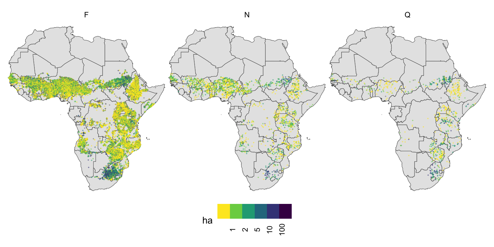

# A region-wide, multi-year set of crop field boundary labels for Africa

This repository hosts the analytical code and links to datasets
resulting from a project undertaken to generate a comprehensive set of
crop field boundary labels throughout the continent of Africa,
representing the years 2017-2023. The project was funded by the [Lacuna
Fund](https://lacunafund.org/), and led by
[Farmerline](https://farmerline.co/), in collaboration with [Spatial
Collective](https://spatialcollective.com/) and the [Agricultural
Impacts Research Group](agroimpacts.info) at [Clark
University](https://www.clarku.edu/departments/geography/).

Please refer to the [technical
report](notebooks/report/technical-report.pdf) for more details on the
methods used to develop the dataset, an analysis of label quality, and
usage guidelines.

The data can currently be obtained from the Zenodo link, and will be
also be added to [Source Cooperative](https://source.coop/). It’s usage
is governed by Planet’s [participant license agreement for the NICI
contract](https://assets.planet.com/docs/Planet_ParticipantLicenseAgreement_NICFI.pdf).

Please cite the dataset as follows:

Wussah, A., Asipunu, M., Gathigi, M., Kovačič, P., Muhando, J., Addai,
F., Akakpo, E.S., Allotey, M., Amkoya, P., Amponsem, E., Dadon, K.D.,
Gyan, V., Harrison X.G., Heltzel, E., Juma, C., Mdawida, R., Miroyo, A.,
Mucha, J., Mugami, J., Mwawaza, F., Nyarko, D., Oduor, P., Ohemeng, K.,
Segbefia, S.I.D., Tumbula, T., Wambua, F., Yeboah, F., Estes, L.D.,
2024. A region-wide, multi-year set of crop field boundary labels for
Africa. Dataset on Zenodo. <https://zenodo.org/record/11060871>.

